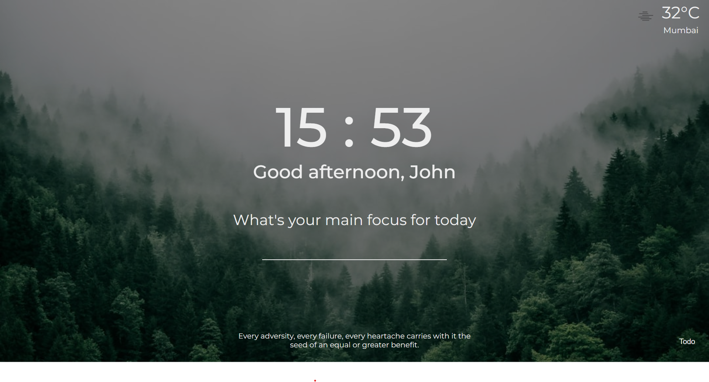

# Focus

 

Focus is an chrome extension that helps you stay focused throughout. You can add your daily tasks and get them completed.
  
 

### Live Link:
You can visit a working site of focus: [click here](https://focusify.netlify.app/)

 

## Features

- Appears on opening new tabs.
- Ask user name on onboarding user for first time
- Greets user based on time of day.
- Displays current weather based on your location using [OpenWeather](https://openweathermap.org/) API.
- New quotes on every page refresh.
- Changing background wallpaper on every page refresh. [UnSplash](https://api.unsplash.com/) API is used.
- User can add main focus for the day.
- You can add tasks to todo list. Upon completing you can also remove it.
 

